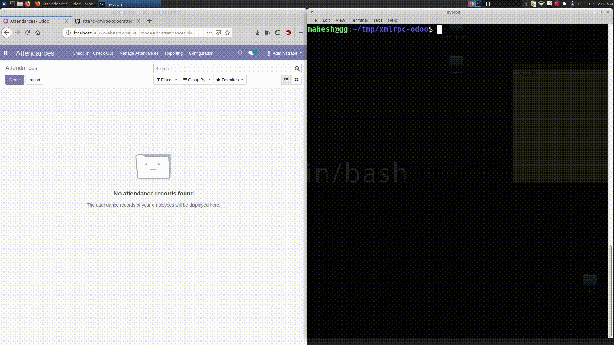

# attend-xml-odoo
> fully functional python script able to xmlrpc with BIERP for CLI based attendances.



## Installation

Linux: (can be modified for windows & osx)

```sh
$ git clone https://github.com/bisolutionsnepal/attend-xmlrpc-bierp
$ cd attend-xmlrpc-bierp
$ chmod +x attend.py
```

## Usage example
```
$ python2 attend.py <username> checkin/out
$ ./attend.py invoron checkin
```
## Making an executeable with pyinstaller
```
$ pip3 install pyinstaller
$ pyinstaller --onefile attend.py
$ cp dist/attend /usr/bin
$ attend <username> checkin/out/status/state
```

